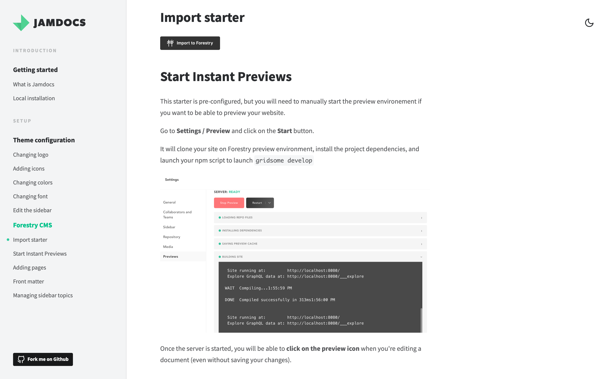

# kid-design-system

## Stacks

* [Gridsome](https://gridsome.org/) team for developing a great foundation to build static sites.
* [Vue](https://vuejs.org)
* [feathericons](https://feathericons.com/), for icons.[vue-feather-icons](https://github.com/egoist/vue-feather-icons).
* [Forestry](https://forestry.io/) for CMS.

## Local installation for development

1. `git clone https://github.com/samuelhorn/jamdocs project-name`.
2. `cd project-name`
3. `gridsome develop`.

## Deploy to Netlify

## Import to Forestry CMS

This project has been pre-configured to work with [Forestry](https://forestry.io). Any changes you make in Forestry will be commited back to your repo. ✨

## Todos

1. Improve the actual documentation for Jamdocs, in Jamdocs :)
2. ~~Build the homepage better, dividing stuff into components and so on.~~
3. Implement Algolia search.
4. ~~Add a link to this repository from the demo.~~

## License

[MIT](https://github.com/samuelhorn/jamdocs/blob/master/LICENSE)